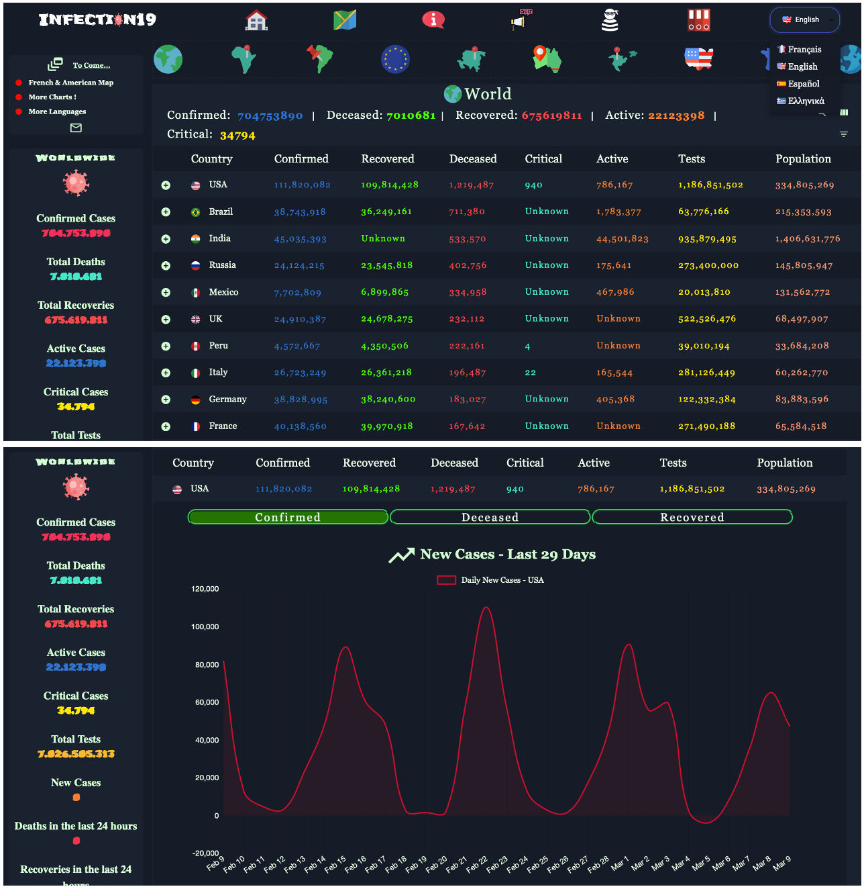

# COVID-19 Data Dashboard - React Project

A ReactJS-based web application for tracking and visualizing global COVID-19 statistics in real-time.
Link to the site ---> https://infection19-bef6c.web.app

<!--  -->
<div align="center">

</div>


  ## Table of Contents
  - [Installation](#installation)
  - [Usage](#usage)
  - [Project Structure](#project-structure)
  - [Contributing](#contributing)
  - [License](#license)

## Features

- **Global Overview**: Summary of confirmed cases, deaths, recoveries, and active cases
- **Country-Specific Data**: Detailed statistics for top affected countries
- **Trend Visualization**: 29-day historical data for new cases (USA-focused in current version)
- **Critical Metrics Tracking**: Monitoring of severe/ICU cases

## Data Sources - API

    - https://covid19.mathdro.id/api
    - https://coronavirusapi-france.now.sh
    - https://disease.sh/v3/covid-19


  ## Installation

  To get started with this project, clone the repository and install the dependencies:

  ```bash
  git clone https://github.com/your-username/your-repo-name.git
  cd your-repo-name
  npm install
  ```
  ## Technologies Used

  This project uses several important libraries and frameworks to provide functionality and enhance the user experience. Below are some of the key dependencies:

  - **React**: A JavaScript library for building user interfaces. (Version: 16.12.0)
  - **Material-UI**: A popular React UI framework for building responsive and accessible web applications. (Core Version: 4.11.0, Icons Version: ^4.9.1)
  - **Axios**: A promise-based HTTP client for making requests to APIs. (Version: 0.19.2)
  - **Bootstrap**: A front-end framework for developing responsive and mobile-first websites. (Version: ^4.5.2)
  - **Chart.js**: A simple yet flexible JavaScript charting library for designers & developers. (Version: ^2.9.3)
  - **React Router DOM**: A collection of navigational components that compose declaratively with your application. (Version: 5.2.0)
  - **Styled-components**: A library for styling React components using tagged template literals. (Version: ^5.1.1)

  For a complete list of dependencies, please refer to the `package.json` file.


  ## Usage

  To run the application locally, use the following command:

  ```bash
  npm start
  ```

  This will start the development server and open the application in your default web browser.

  ## Project Structure

  - **/src/index.js**: Entry point of the application.
  - **/src/App.js**: Main application component with routing setup.
  - **/src/components**: Contains reusable components like NavBar.
  - **/src/pages**: Contains page components like Home, About, News, etc.

  ## Contributing

  Contributions are welcome! Please fork the repository and submit a pull request for any improvements or bug fixes.

  ## License

  This project is licensed under the MIT License. See the [LICENSE](LICENSE) file for more details.
